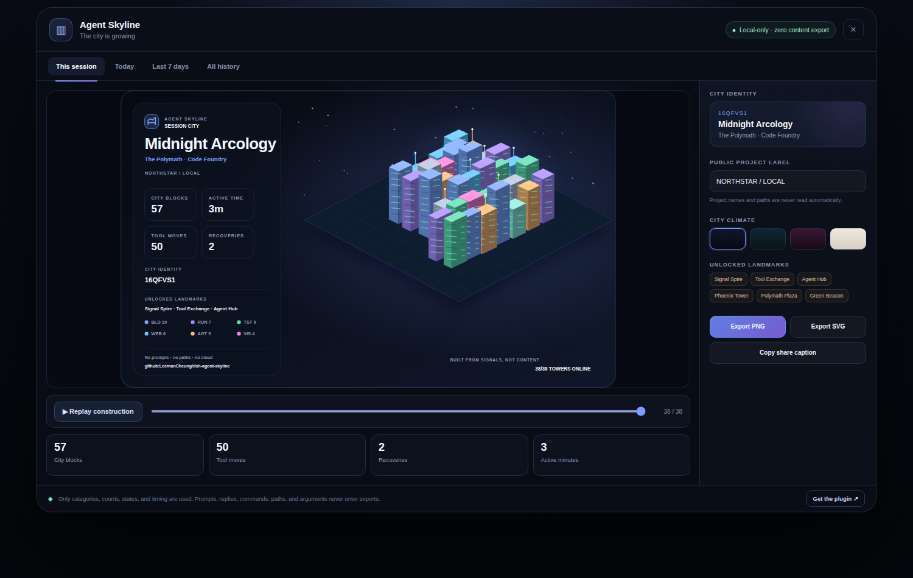
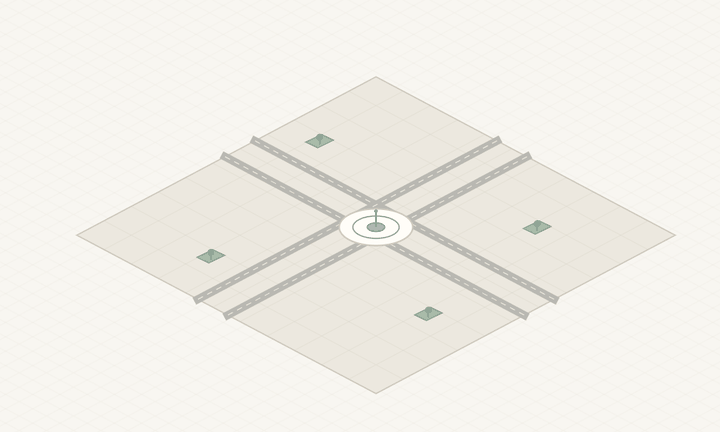
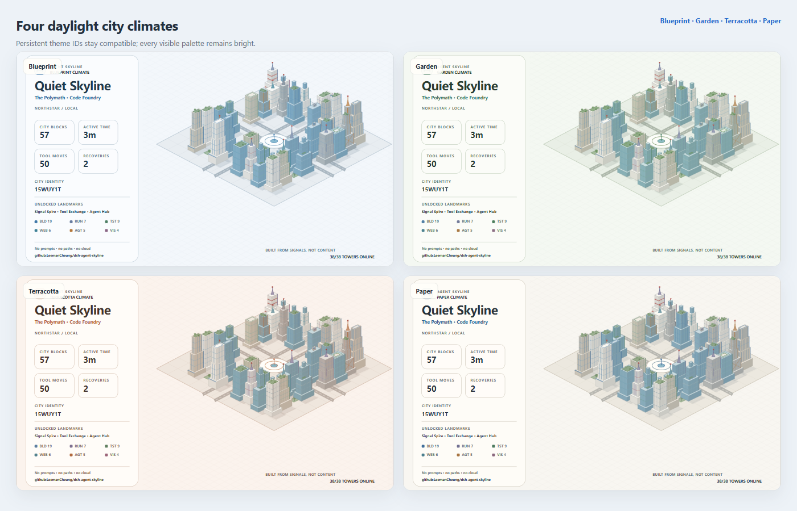
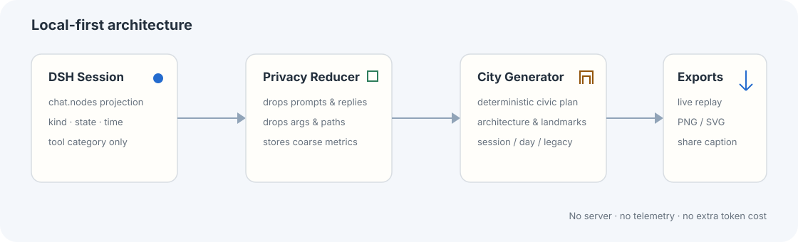

# dsh-agent-skyline

> 把每一次 DeepSeek Harness Agent 工作，建成一座独一无二、可回放、可分享的程序员城市。



`dsh-agent-skyline` 是一个 **local-first、零额外 Token、默认不读取内容** 的 DSH Web 插件。它把会话中的粗粒度活动信号转换成程序化城市：文件操作成为建筑，测试成为验证中心，Web 检索成为观测塔，子 Agent 与 Workflow 成为协作枢纽，失败后的成功恢复会解锁 Phoenix Tower。

这不是一个只看一次的统计面板，而是一套有持续成长和传播闭环的视觉产品：

- **本次会话、今天、近 7 天、全部历史** 四种城市视角；
- **一键回放建城过程**，可拖动时间轴逐栋查看；
- **PNG / SVG 导出**与自动生成分享文案；
- **Blueprint / Garden / Terracotta / Paper** 四套日光视觉气候；
- **地标解锁、城市身份、稳定 City ID**，形成可收藏的个人资产；
- 历史仅保存在浏览器 `localStorage`，不会创建服务器、数据库或遥测服务。



[本地交互演示源码](demo/) · [English README](README.md) · [选题分析](docs/market-analysis.zh-CN.md) · [首发方案](docs/launch-playbook.zh-CN.md)

> **发布目标：** 当前分支及截图对应已完成本地终审的 `v1.1.0` 日光重设计。下方安装命令固定到不可变的 `v1.1.0` Tag，该 Tag 发布后即可使用。

## 为什么它更有传播潜力

多数统计插件解决“我想看数据”，Agent Skyline 同时解决三个问题：

1. **三秒能懂**：看到截图即可理解“Agent 工作变成了一座城市”；
2. **每个人不同**：工具组合、复杂度、恢复次数和协作方式共同决定城市形态；
3. **分享即分发**：导出的卡片自带项目标识与安装线索，但不泄露会话内容。

它把插件从“安装后自己使用”变成“用户持续生产可传播内容”。完整选题分析见 [`docs/market-analysis.zh-CN.md`](docs/market-analysis.zh-CN.md)。

## 核心功能

| 模块         | 能力                                                                  |
| ------------ | --------------------------------------------------------------------- |
| 城市生成     | 根据会话节点确定性生成等距程序化城市，相同会话得到稳定结果            |
| 四种时间范围 | Session / Today / 7-day / All-time，历史按会话去重聚合                |
| 动态回放     | 播放、暂停、重播、拖动建城进度，支持减少动态效果系统设置              |
| 城市语义     | Build、Run、Verify、Explore、Orchestrate、See、Think、Direct 九类活动 |
| 身份系统     | 城市名、Agent Archetype、District、City ID、地标解锁                  |
| 分享导出     | 2× PNG、原生 SVG、隐私说明、分享文案复制                              |
| 视觉系统     | Blueprint、Garden、Terracotta、Paper；桌面与移动端响应式布局          |
| 隐私设计     | 不保留提示词、回复、参数、命令、文件路径、工作区名称                  |
| 工程质量     | Node 内置测试、确定性测试、历史迁移、XML 转义、隐私泄漏烟测、CI       |

## 四套城市气候

同一座城市可以切换 Blueprint、Garden、Terracotta、Paper 四套日光视觉系统；只改变表达，不改变城市身份和数据。为兼容已有浏览器状态，底层仍保留 `midnight`、`aurora`、`sunset` 主题 ID。



## 活动如何变成城市

| Agent 信号                 | 城市表达              |
| -------------------------- | --------------------- |
| 文件读取、编辑、Patch      | Build District 建筑群 |
| Shell、Terminal、Process   | Runtime 工业塔        |
| Test、Lint、Check、Build   | Verification Labs     |
| Web Search、Browser、Fetch | Horizon Observatories |
| Agent、Workflow、Delegate  | Constellation Hubs    |
| Vision、Screenshot、Render | Prism Towers          |
| Thinking、LLM Steps        | Thought Spires        |
| User / Conversation Turns  | Signal Plazas         |
| 失败后同类操作恢复成功     | Phoenix Tower 地标    |

映射只保留“类别、结果、时长、时间戳”四类粗粒度信号。原始文本不会进入标准化事件，也不会进入 SVG、PNG、分享文案或本地历史。

## 安装

确保已经运行 DSH Web：

```bash
npx @deepseek-ai/dsh web
```

从 GitHub 安装：

```bash
dsh plugin --profile web add "github:LeemanCheung/dsh-agent-skyline#v1.1.0"
```

随后在 DSH Web 的 **Settings → Plugins** 中确认 `dsh-agent-skyline` 已启用。插件包已声明 `dsh.bundle.patch`，会在 Web Profile 中注册客户端入口。

如需先独立预览浏览器演示：

```bash
npm run demo
python3 -m http.server 4173 --directory demo
```

随后打开 `http://127.0.0.1:4173/`。

## 使用

打开任意 Session，在会话头部点击 **Agent 天际线**：

1. 默认展示当前会话城市；
2. 切换“今天 / 近 7 天 / 全部历史”查看持续成长；
3. 点击“重新播放”观看建城过程，或拖动进度条；
4. 选择城市气候，按需填写公开项目署名；
5. 导出 PNG / SVG，或复制自动生成的分享文案。

项目名和工作区路径不会自动读取。公开署名必须由用户主动填写，默认展示 `PRIVATE PROJECT`。

## 隐私模型

```text
DSH Session chat.nodes
        │
        ▼
Privacy Reducer
- 丢弃 prompt / reply
- 丢弃 tool args / command
- 丢弃 path / workspace name
        │
        ▼
category + outcome + duration + timestamp
        │
        ├── 当前会话内存模型
        ├── 浏览器 localStorage 聚合快照
        └── SVG / PNG / 分享文案
```



### 明确不做的事情

- 不向任何服务器发送数据；
- 不调用额外模型，不增加 Token 消耗；
- 不保存会话正文、工具参数或文件路径；
- 不读取 Git 仓库名、工作区名或用户名作为默认标签；
- 不创建全局排行榜或用户画像服务。

历史快照可以在面板中一键清除；它只影响 Agent Skyline，不影响 DSH Session。

## 开发与验证

项目无运行时第三方依赖，构建脚本只使用 Node.js 标准库。

```bash
npm run check
```

该命令依次执行：

```text
JavaScript 语法检查
→ 27 项单元测试
→ DSH 浏览器 Bundle 构建
→ Bundle 语法检查
→ Manifest / Patch / Slot / 隐私烟测
→ 演示资产确定性重建
→ 已提交媒体 Manifest 校验
```

独立执行：

```bash
npm test       # 纯逻辑与隐私测试
npm run build  # 生成 lib/client.js 与 demo/core.js
npm run demo   # 重建 docs/preview.svg 与 docs/architecture.svg
npm run determinism   # 双跑并比对 Bundle、SVG 与逐帧 SVG
npm run assets:verify # 校验已提交媒体尺寸、帧数、字节数与 SHA-256
npm run pack          # 只读检查 npm 打包清单
```

测试会主动注入私密 Prompt、私有文件路径和带 Authorization 的命令，并断言这些字符串不会出现在标准化事件、SVG 或分享文案中。

## 架构

```text
src/core.js
  ├─ lossy event normalizer
  ├─ metrics & recovery detector
  ├─ history reducer / range aggregation
  ├─ deterministic city generator
  └─ self-contained SVG renderer

src/client.js
  ├─ conversation.session.header.actions slot
  ├─ local history persistence
  ├─ replay / theme / range controls
  ├─ PNG / SVG export
  └─ responsive modal UI

scripts/build.mjs
  └─ embeds core + CSS into DSH ModuleLoader client bundle
```

## 发布与传播

仓库已包含一套可直接执行的发布方案：

- [`docs/launch-playbook.zh-CN.md`](docs/launch-playbook.zh-CN.md)：首发节奏、内容模板、指标与迭代机制；
- [`demo/`](demo/)：使用真实核心逻辑的浏览器交互演示源码，可切换范围、主题、回放和导出；
- [`docs/ui-preview.png`](docs/ui-preview.png)：完整桌面产品界面；
- [`docs/mobile-preview.png`](docs/mobile-preview.png)：390px 响应式产品界面；
- [`docs/preview.png`](docs/preview.png)：完整导出卡片；
- [`docs/social-preview.png`](docs/social-preview.png)：1280×640 仓库 Social Preview；
- [`docs/construction.gif`](docs/construction.gif)：建城过程动图；
- [`docs/themes.png`](docs/themes.png)：四主题视觉矩阵；
- [`docs/architecture.svg`](docs/architecture.svg)：隐私架构图；
- [`docs/assets-manifest.json`](docs/assets-manifest.json)：尺寸、哈希与生成谱系；
- [`docs/ASSET_REPRODUCTION.md`](docs/ASSET_REPRODUCTION.md)：仅回环网络的资产复现流程；
- [`docs/validation-report.md`](docs/validation-report.md)：自动化、浏览器渲染与打包验证报告；
- 中英文 README、CI、Security、Contributing 与 Changelog。

## 兼容性与降级

- 面向 DSH Web Profile；
- `1.1.1` 源码已验证兼容 DSH `0.1.2-rc.1` 的插件接口；验证范围和 Provider 无关的边界见 [`docs/compatibility-0.1.2-rc.1.md`](docs/compatibility-0.1.2-rc.1.md)；
- DSH 当前仍处于开发者预览阶段，建议固定插件 Release Tag，并在每次 DSH 升级后重新执行宿主验收清单；
- Node.js 构建环境要求 `>= 20`；
- 浏览器需要支持 React 18、SVG、Canvas、Blob 与 `localStorage`；
- PNG 编码失败时自动回退为 SVG 下载；
- `localStorage` 不可用时，当前 Session 城市仍可正常生成与导出；
- 遵循 `prefers-reduced-motion`，关闭非必要动画。

## 路线图

后续版本将聚焦传播效率和本地只读联动，而不是堆叠设置：

- 竖版 9:16 小红书 / 抖音分享卡；
- 可选的匿名“城市种子”导入导出，实现不上传数据的城市交换；
- 更多稀有地标和季节事件；
- 与 `dsh-task-dag`、`dsh-token-usage` 的本地只读联动；
- 一键生成 README 徽章与 GitHub Profile 城市缩略图。

## License

MIT © 2026 Leeman Cheung
